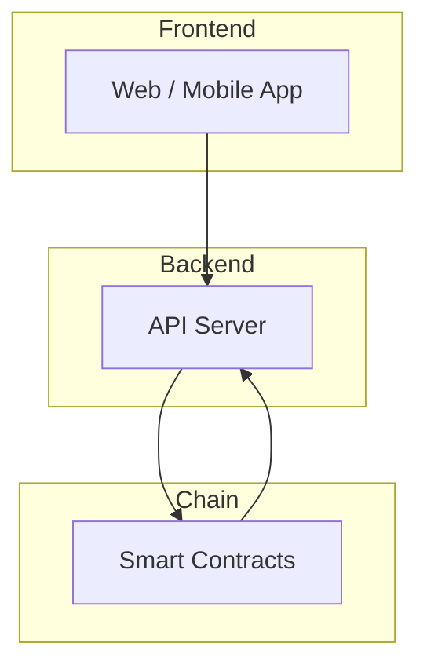
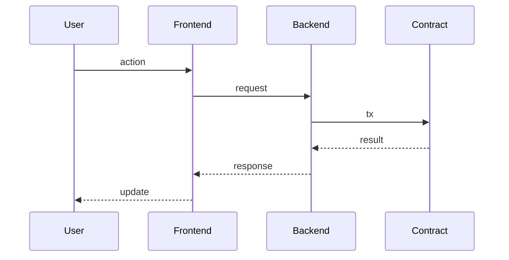
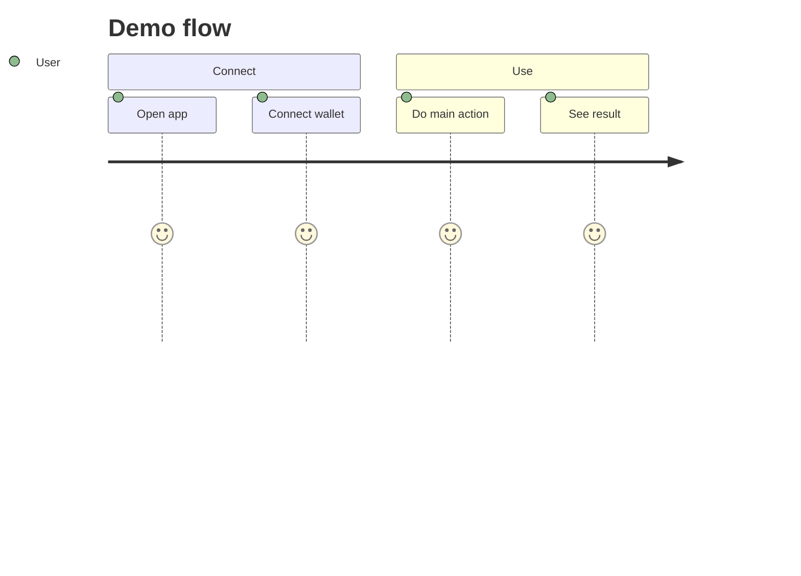

# Technical: Architecture, Setup & Demo

One place for **how** the system works and how to run and use it. Replace the sections below with your content.

**Tip:** Use [Mermaid](https://mermaid.js.org/) to draw architecture, data flow, and user flows. GitHub and most doc platforms render Mermaid in fenced code blocks with ` ```mermaid `.

---

## 1. Architecture

- **System overview** — High-level description of the full system.
- **Components** — Frontend, backend, smart contracts (or equivalent); how they connect.
- **Data flow** — How data moves through the system step-by-step.
- **On-chain vs off-chain** — What runs on-chain vs off-chain (if applicable).
- **Security** — Main risks and how you mitigate them.

**Optional — component diagram (Mermaid):** Example of a high-level system view:



**Optional — data flow (Mermaid):** For step-by-step flows, a sequence diagram works well:



Replace nodes and labels with your actual components and flow.

---

## 2. Setup & Run

- **Prerequisites** — Required tools, versions, accounts (e.g. Node 18+, MetaMask, testnet faucet).
- **Environment** — Env vars, API keys, endpoints (use `.env.example` if needed).
- **Install & build** — Commands to install dependencies and build.
- **Run** — How to start each part (e.g. backend, contracts, frontend) and in what order.
- **Verify** — How to confirm it works (e.g. tests, open URL, run a script).

---

## 3. Demo Guide

- **Access** — How to open the app (URL, local run, or testnet link).
- **User flow** — Step-by-step for a typical user.
- **Key actions** — Main things to try (e.g. connect wallet, create item, stake).
- **Expected outcomes** — What the user should see at each step.
- **Troubleshooting** — Common issues (wrong network, test tokens, etc.) and fixes.

**Optional — demo user journey (Mermaid):** A small diagram makes the flow easy for judges to follow:



Or use a `flowchart` with your real steps. This complements the written steps above.
